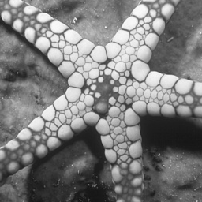

# denoising_autoencoder

---------------
This is a part of course project for Image and Video Processing (EE6310).
Team 12
---------------

This is a simple autoencoder based implementation for denoising images. For training, the dataset used in [DnCNN-Pytorch](https://github.com/SaoYan/DnCNN-PyTorch) is used here too. Testing is done on Set12 and Set68 respectively.

Everything can be visualized in `visualize.ipynb`. For training again, the train function can be utilized from `utils.py`.

## infer results
`infer.py` can be used to denoise a noisy image. A clean image can be provided, on which a noise with level 15 is added before denoising. If passing a noisy image use the flag `--already_noisy`. for general infering:
```
python infer.py --img_path <img_path> --save_dir <save directory>
```
## Results

The simple architecture is quite effective in denoising as can be observed in `visualize.ipynb`. `training_journey.gif` shows the output of the model after each epoch during training of 40 epochs. The training details can also be seen in `visualize.ipynb`

Visualizing the model training:
<p align= 'center'></p>

Sample denoising:
|Ground Truth|Noisy ($\sigma = 15$)|Denoised|
|:----------:|:----------:|:----------:|
||||

SSIM map wrt ground truth comparison:
|ssim map: Noisy ($\sigma = 15$)|ssim map: Denoised|
|:----------:|:----------:|
|||

SSIM and PSNR are used as metrics to measure performance. <b>NOTE:</b> noise level of 15 was used to train and test the model:
|Test Set|average SSIM|average PSNR|
|:--------:|:----------:|:-----------:|
|Set12|0.826|25.248|
|Set68|0.806|25.671|
